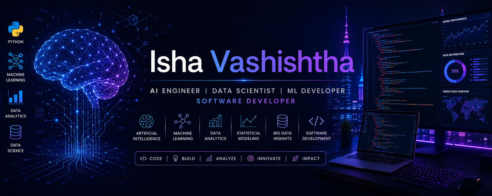

  

# Hi 👋, I'm Isha Vashishtha

### 🚀 AI Engineer | Data Science Enthusiast | Machine Learning Developer | Software Developer | Problem Solver

---

## 🌟 About Me

🎓 Pursuing **B.Tech (Honours) in Computer Science Engineering (AI & Analytics)** at **GLA University, Mathura**

💡 Passionate about:

- Artificial Intelligence
- Machine Learning
- Data Science
- Deep Learning
- Generative AI
- Software Development

🎯 Career Goal:

> To become a world-class AI Engineer and Data Scientist capable of building impactful solutions that solve real-world problems.

---

## 🚀 My Journey

### 🌱 Where It Started

My journey into technology started with curiosity about how applications work behind the scenes.

Initially, I explored:

- HTML
- CSS
- JavaScript
- Python

As I built small projects, I discovered my passion for Artificial Intelligence and Data Science.

---

### 💻 First Projects

My learning journey began with projects like:

- Personal Portfolio Website
- Stopwatch Application
- Calculator
- To-Do Application
- Q&A Chatbot

These projects helped me understand:

- Frontend Development
- Backend Logic
- API Integration
- Problem Solving

---

### 🤖 Entering AI & Machine Learning

To build a strong foundation, I completed:

🏆 Andrew Ng Machine Learning

🏆 IBM Python for Data Science

🏆 Microsoft Azure AI Fundamentals

Then I started working on:

- Machine Learning Models
- Deep Learning Models
- Computer Vision Applications
- Explainable AI Systems

---

### 🌾 AI Crop Disease Detection System

One of my major projects:

#### Features

✅ Crop Disease Classification

✅ Deep Learning Based Prediction

✅ Treatment Recommendation

✅ Environmental Monitoring

✅ Explainable AI Integration

#### Technologies

- Python
- TensorFlow
- ResNet50
- MobileNetV2
- OpenWeather API
- Streamlit

---

### 🏥 Explainable AI for Healthcare

Built a healthcare prediction system using:

- ResNet50
- VGG16
- EfficientNet

Explainability Features:

- LIME
- Grad-CAM

Goal:

Help healthcare professionals understand model predictions instead of relying on black-box outputs.

---

### 📚 Research Assistant Agent

Built an AI-powered research assistant capable of:

- Fetching papers from arXiv
- Extracting PDF content
- Question Answering
- Research Summarization

Tech Stack:

- Gemini API
- Streamlit
- PyMuPDF
- Transformers
- Heurist Framework

---

### 📈 Smart Portfolio Analysis Tool

Developed a system that:

- Analyzes investments
- Predicts returns
- Evaluates risk
- Generates insights

Technologies:

- Python
- Data Analytics
- Financial Modeling
- Machine Learning

---

### 💰 Daily Expense Tracker

Tech Stack:

- Flutter
- Django
- Machine Learning

Features:

- Expense Tracking
- Spending Analysis
- Intelligent Insights
- Visualization Dashboard

---

## 💼 Internship Experience

### 🌟 Prodigy Infotech

**Data Science & Development Intern**

Worked on:

- AI Applications
- Data Analysis
- Machine Learning Projects
- Real-world Problem Solving

---

### 🌟 Web Development Internship

Worked on:

- Frontend Development
- Backend Integration
- Responsive Web Design

---

## 🏆 Achievements

🥇 Microsoft Azure AI Fundamentals

🥇 IBM Python for Data Science

🥇 Andrew Ng Machine Learning

🥇 Google Summer Internship Shortlisted

🥇 STEP Program Shortlisted

🥇 Hackathon Participant

🥇 Multiple AI & ML Projects Developed

---

## 📚 Currently Learning

- Advanced DSA
- System Design
- MLOps
- Generative AI
- Agentic AI
- Large Language Models
- Cloud Computing

---

## 💻 Tech Stack

### Programming Languages

### AI / Machine Learning

### Frameworks

### Databases

### Tools

---

# 🔥 Featured Projects

| Project | Description |
|----------|------------|
| 🌾 AI Crop Disease Detection | Deep Learning based disease prediction |
| 🏥 XAI Healthcare System | Explainable AI for medical predictions |
| 📚 Research Assistant Agent | AI-powered research paper assistant |
| 📈 Smart Portfolio Analyzer | Investment analysis platform |
| 💰 Expense Tracker | Flutter + Django financial application |
| 🧠 Cancer Prediction System | Healthcare prediction using ML |

---

## 📊 GitHub Analytics

---

## 📈 Activity Graph

---

## 🧠 LeetCode Progress

---

## 🏅 GitHub Trophies

---

## 🐍 Contribution Snake

---

## 🎯 2026 Goals

- Solve 1000+ DSA Problems
- Master System Design
- Become an Open Source Contributor
- Publish AI Research Work
- Build Scalable AI Applications
- Secure a Top Data Scientist / AI Engineer Role

---

## 🌍 Connect With Me

---

### ✨ "Success is the result of consistent learning, hard work, and perseverance."

